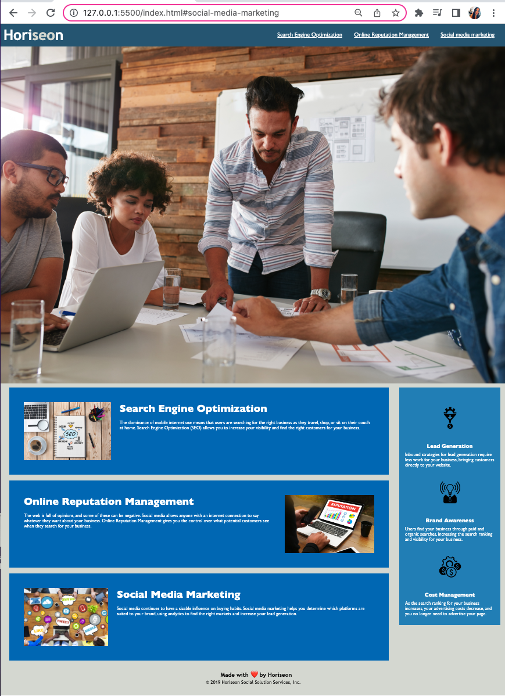

# Code Refactor

A webpage will be build that will hold a collection of CSS snippets. 
So we can learn the base of CSS.

---
## User Story

AS A marketing agency

I WANT a codebase that follows accessibility standards

SO THAT our own site is optimized for search engines

---
## Acceptance Criteria
It's done when the webpage meets accessibility standards

It's done when I view the source code

It's done when I find semantic HTML elements

It's done when I view the structure of the HTML elements

It's done when I find that the elements follow a logical structure independent of styling and positioning

It's done when I view the icon and image elements

It's done when I find accessible alt attributes

It's done when I view the heading attributes

It's done when they fall in sequential order

It's done when I view the title element

It's done when I find a concise, descriptive title

---
## Assets
The following link demonstrates deployment link:
https://zazgh.github.io/02-challenge/

The following image demonstrates the web application's appearance and functionality:

